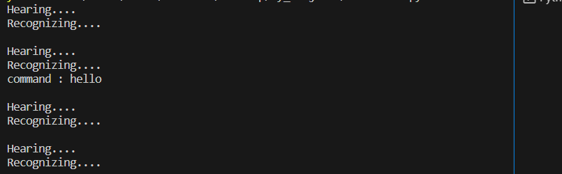

# Voice-Activated Virtual Assistant

## Introduction

Welcome to the Voice-Activated Virtual Assistant project! This Python-based virtual assistant allows users to interact with their computer using natural voice commands. It can perform various tasks, provide real-time information, and even tell jokes and fun facts.

## Features

- **Voice Recognition**: Understands spoken commands for intuitive interaction.
- **Task Execution**: Executes predefined actions in response to recognized commands.
- **Web Searches**: Provides search results from the web based on user queries.
- **Time and Date Information**: Offers real-time time and date updates.
- **Entertainment**: Entertains users with humor and interesting facts.

## Technologies Used

- Python: The core programming language.
- Pyttsx3: For text-to-speech synthesis, providing natural voice responses.
- SpeechRecognition: Converts spoken language into text for command recognition.
- Webbrowser: To open web searches in the default browser seamlessly.
- datetime: For real-time time and date information, enhancing user experience.

## Getting Started

1. **Clone the Repository:**
git clone https://github.com/yashNiwane/assistant.git

2. **Install Requirments**
pip install pyttsx3
pip install speech_recognition
pip install webbrowser
pip install datetime
pip install wikipediaapi
pip install pyjokes

3. **Run the Virtual Assistant:**
python assistant.py
